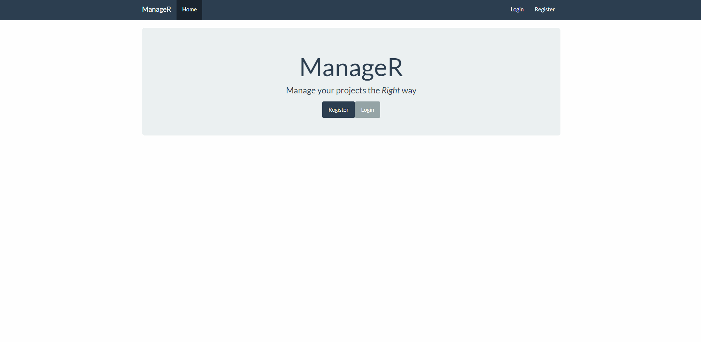

# Angular Application for Project Management

 

An application which allows you to create, maintain and update projects via an online interface. 

All user actions must be authenticated. Authentication is handled via JWT. Data is persisted via MongoDB. CI is provided by TravisCI. 

You can find documentation regarding the API endpoints at the [bottom of this README file](https://github.com/krynv/project-management-MEAN#api-documentation).

## Demo

## Install
Please note: You may need to have Python version 2.7 installed for the node-gyp dependency. 

Clone repo: 

    git clone git@github.com:krynv/project-management-mean.git && cd project-management-mean

Download dependencies: 

    npm i && npm i -g nodemon && npm i -g @angular/cli
    cd client/ && npm i

Start MongoDB:

    sudo mongod

In a separate tab: 

    mongo

Start express server: 

    npm start

Start client:

    cd client/ && npm start

Access API on port `1337`

Access Dev client on port `4200`

## API Documentation

The full project collection can be found here:
https://www.getpostman.com/collections/ff7f3a46fbf3ef6c528c

To access the `administrator` functionality, you will need to manually create an `admin` user in your database. 
Simply edit one of your existings users and change their `admin` flag to `true`.

In order to use any of the API endpoints, you will need to be logged in/ authenticated. 
Simply register a user and log in via the `/login` endpoint. 
Copy the `token` and use this in the body of any future requests. 